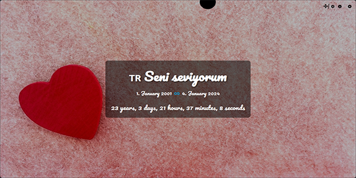
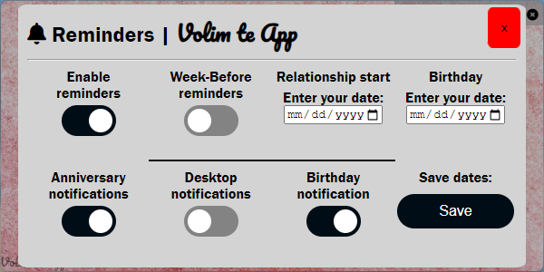
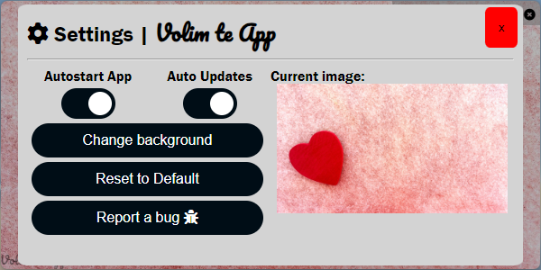

# Volim Te App - Celebrate Your Love Journey

## Table of concepts
- [Overview](#overview)
  - [Key Features](#key-features)
  - [Screenshots](#screenshots)
- [Built with](#built-with)
- [Links](#links)
- [Author](#author)

# Overview

Volim Te App is a delightful application designed to cherish and celebrate the beautiful journey of love. With this app, you can set the special date that marks the beginning of your relationship, and it will enchantingly calculate and display the exact duration in months, days, hours, minutes, and seconds since that memorable moment.

## Key Features:

 - Countdown to Love:
   Set the significant date when your love story began, and let Volim Te App do the magic. Experience the joy of watching the countdown as it unveils the passage of time, expressing the unique journey you've shared.

 - Precision in Timekeeping:
   Revel in the accuracy of timekeeping as Volim Te App precisely calculates the duration down to the last second. It's a personalized countdown that encapsulates the depth and longevity of your relationship.

 - Customizable Backgrounds:
   Tailor the app to reflect your personal style and preferences. Choose from a collection of captivating backgrounds or upload your own cherished photos to create a visually appealing and meaningful backdrop.

 - Intuitive User Interface:
   Volim Te App features a user-friendly interface that makes navigation and customization a breeze. Effortlessly set your relationship's starting date, change backgrounds, and explore the app's features with ease.

 - Heartwarming Reminders:
   Receive gentle reminders and celebrate milestones together. Whether it's monthly anniversaries or special occasions, Volim Te App ensures that you never miss a chance to express your love and appreciation.
   

Express your love, commemorate your journey, and savor every moment with Volim Te App - Where Love Counts Every Second.

## Screenshots
Screenshots are from earlier versions

## Built with
  - HTML5
  - CSS3
  - Javascript

## Links
- Website - [www.sehic.rf.gd/volimte](https://sehic.rf.gd/volimte)
- Download - [www.sehic.rf.gd/volimte#download](https://sehic.rf.gd/volimte#download)
- Contact - [www.sehic.rf.gd/contact](https://sehic.rf.gd/#contact)

## Author

- LinkedIn - [@Muhammed Šehić](https://www.linkedin.com/in/muhammed-%C5%A1ehi%C4%87-31a7b6175/)
- GitHub - [@MuxBH28](https://github.com/MuxBH28)
- Website - [www.sehic.rf.gd](https://sehic.rf.gd/)
- Contact - [www.sehic.rf.gd/#contact](https://sehic.rf.gd/#contact)
